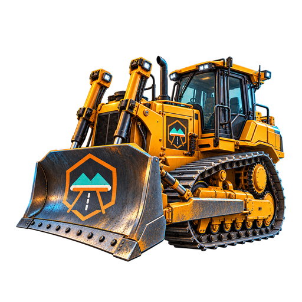

# Icono de vehículo · RoadCraft Studio

[Documentación](README.md) · [Portada](../README.md)



## Diseño y procedencia

Basado en la dirección visual de la portada «Proyectos de Oscar»: máquina de construcción amarilla de orugas, con pala de acero.
El emblema anterior está integrado en la pala y el lateral de la maquinaria; el vehículo completo es el icono, sin un cuadro externo.
Son ilustraciones conceptuales originales generadas con la herramienta integrada ImageGen, no modelos extraídos ni vehículos oficiales del juego.

El maestro PNG con transparencia real se guarda en [app-icon-master.png](../src/assets/app-icon-master.png).
El [emblema de referencia](../src/assets/app-emblem.png) se conserva para documentar la identidad.
La ilustración se usa en la cabecera, la animación de inicio, la ventana y el instalador.

## Exportación reproducible

```powershell
npm run icons:generate
npm run test:icons
node scripts/test-packaged-icons.mjs
```

No se regenera la ilustración ni se hace ninguna petición de IA: el script convierte el maestro con Electron, conserva el canal alfa y añade un margen de seguridad del 5% por lado.
Se generan PNG de 512 px e ICO con 16, 24, 32, 48, 64, 128 y 256 px. 
El comprobador verifica tamaños, transparencia, integridad del ICO y coincidencia exacta con el maestro.
Tras compilar, la prueba del paquete verifica que los siete recursos estén realmente incrustados en el EXE y el instalador, y que el icono de la ventana se incluya en los archivos distribuidos.
Las pruebas de interfaz comprueban el hash del PNG realmente cargado y capturan los siete tamaños sobre fondo claro y oscuro.

## Prompt final

Modo: herramienta integrada ImageGen; una composición por proyecto, sin API/CLI alternativo.

Referencias locales al generar: ilustración del vehículo de la portada y emblema anterior del proyecto.
Ambas se inspeccionaron antes de la composición; el vehículo es la referencia visual y el emblema es el elemento insertado.

```text
Use case: compositing.
Asset type: finished square Windows application icon, RoadCraft Studio.
Input images: Image 1 is the bulldozer from the user's project portal, vehicle identity and rendering reference. Image 2 is the existing RoadCraft Studio emblem, to be incorporated as a physical painted/enameled logo ON the vehicle.
Primary request: turn the industrial tracked bulldozer into a polished app icon. Integrate the orange hexagonal bridge-and-road emblem with teal mountain detail prominently on the large steel front blade and a smaller visible side engine panel, in realistic perspective, like an actual company livery. The vehicle itself IS the icon, not a badge behind it. Retain amber-yellow body, cab, hydraulic cylinders, believable continuous steel tracks and wide blade from Image 1.
Composition: ONE centered complete bulldozer, compact three-quarter view facing left, square canvas, occupying roughly 90% width and 78% height with safe margin around blade, tracks and cab. Bold icon-readable silhouette, crisp detailed but visually simplified surfaces.
Lighting: warm amber body, cool cyan edge light, dark graphite steel blade, strong contrast on light AND dark desktop backgrounds.
Background: genuinely transparent alpha, no landscape, ground, halo, glow cloud, gradient or rectangular background, no shadow beyond silhouette.
Constraints: keep reference vehicle design and emblem geometry; no text, lettering, manufacturer insignia, watermark, extra objects, floating badges, framing tile or disconnected logo. Original conceptual artwork, not an official game model.
```

